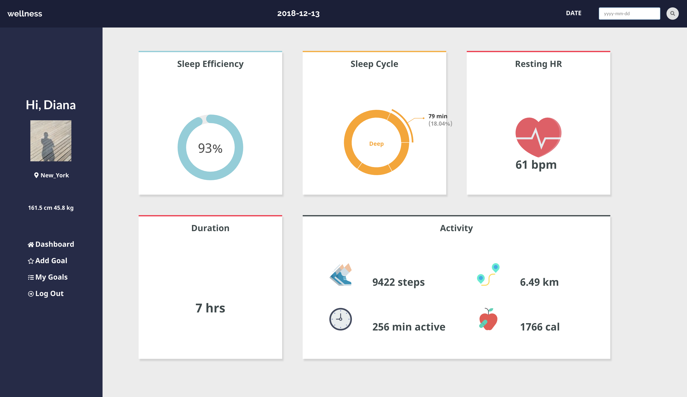

# wellness

Analyzes and displays your activity and sleep data using your Fitbit device. Requires a Fitbit account in order to log in and gain consent to access your data. Using Recharts node package, it will display a pie chart with a breakdown of total minutes spent in the light, wake, rem, and deep cycles as well as sleep duration, resting heart rate, and activity for a specific day. Also allows you to add personal goals.    

This is the frontend and the backend can be found [here](https://github.com/dianajyoo/wellness-backend).




## Development Setup

### Frontend Instructions
```
npm install
npm start
```

### Backend Instructions
```
bundle install
rails db:create
rails db:migrate
rails s
```

## Built With

* React
* Redux
* Ruby on Rails
* CSS
* Semantic UI React
* Fitbit Web API


Dashboard icon made by [Freepik](https://www.flaticon.com/) and licensed by [creativecommons](http://creativecommons.org/licenses/by/3.0/)
